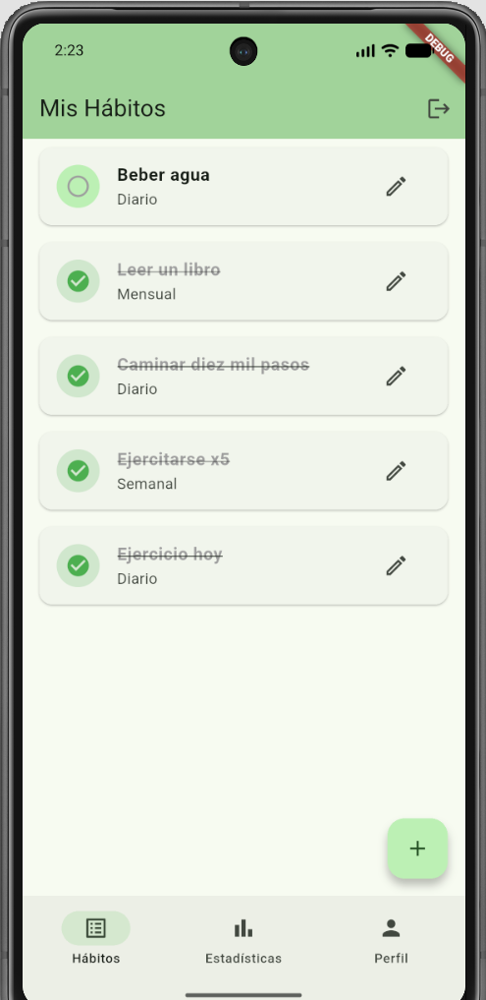
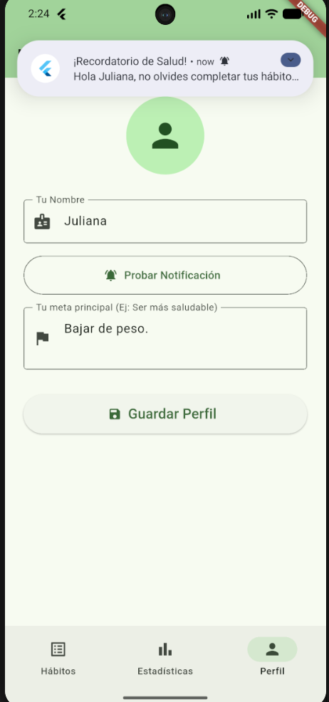
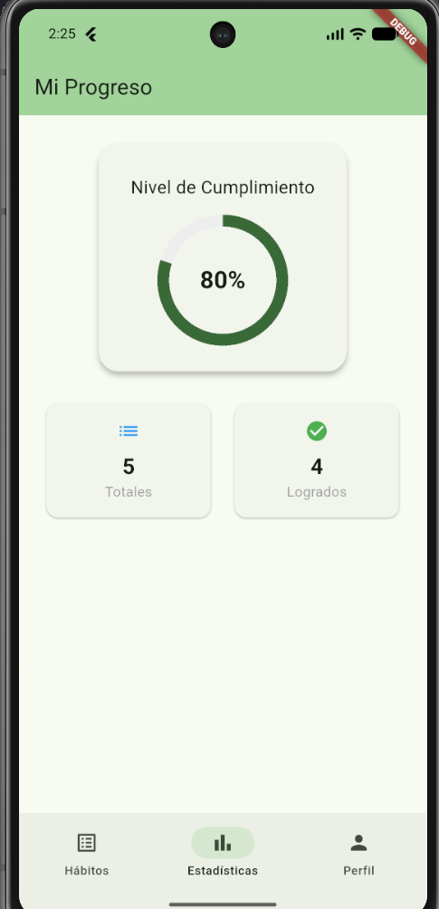

# App de Hábitos Saludables

Una aplicación móvil desarrollada en Flutter para el seguimiento de hábitos de salud, permitiendo al usuario establecer metas, visualizar su progreso y recibir recordatorios diarios.

## Desarrollado por Juliana Bustos Arboleda

## Descripción del Proyecto
Este proyecto es la implementación de todos los temas abordados durante la asignatura de Aplicaciones para Dispositivos Móviles. Siguiendo las sugerencias presentadas por el docente en la rúbrica, escogí desarrollar una aplicación que permita hacer un seguimiento a los hábitos establecidos por el usuario debido a que es un ámbito de mi interés personal y me permitió aplicar lo visto en clase de forma dinámica y creativa, sobre todo al intentar analizar aspectos como las animaciones utilizadas en la sección de estadísticas. Espero que este proyecto sea útil como base para el desarrollo de otras personas.

## Diagrama de Arquitectura
El proyecto fue construido siguiendo los principios de **Clean Architecture** para asegurar escalabilidad y separación de responsabilidades:

- **Presentation:** Interfaz de usuario (UI), Widgets y gestión de estado con `Provider`.
- **Domain:** Modelos de datos (`Habit`) y Casos de Uso (Lógica de negocio aislada).
- **Data:** Repositorios y Datasources (Conexión con API REST en Python y SharedPreferences).

## Decisiones Técnicas Documentadas
- **Gestión de Estado:** Se utilizó `Provider` por su eficiencia y simplicidad para inyectar dependencias en toda la app.
- **Enrutamiento:** Se implementó `go_router` para una navegación declarativa y segura entre las 5 pantallas principales.
- **Backend / API:** Se consumió una API REST propia construida en Python (FastAPI) para el CRUD de los hábitos.
- **Persistencia Local:** Se usó `SharedPreferences` para guardar los datos del perfil de usuario y sus metas localmente.
- **Hardware Nativo:** Integración de `flutter_local_notifications` para programar recordatorios locales al usuario.
- **Testing:** Se utilizó `mocktail` para simular la base de datos y garantizar la cobertura de pruebas unitarias y de widgets.

## Instrucciones de Instalación y Ejecución

### 1. Levantar el Servidor Backend (Python/FastAPI)
1. Abrir la terminal en la carpeta del backend.
2. Instalar dependencias: `pip install fastapi uvicorn`
3. Ejecutar el servidor: `uvicorn main:app --host 0.0.0.0 --port 8000 --reload`

### 2. Ejecutar la App Flutter
1. Clonar este repositorio.
2. Abrir la terminal en la raíz del proyecto Flutter y descargar los paquetes:
   ```bash
   flutter pub get

## 3. Ejecutar la aplicación usando el dispositivo Android o emulador
1. Ejecutar el comando `flutter run`

**Nota:** En caso de presentar problemas con la API, es necesario asegurarse de que la IP en habit_remote_datasource.dart coincida con la del emulador o la del dispositivo usado.

## 4. Capturas de pantalla del programa en funcionamiento:
<p align="center">
  <table align="center">
    <tr>
      <td><br align="center">Login</td>
      <td><br align="center">Dashboard</td>
      <td><br align="center">Estadísticas</td>
    </tr>
  </table>
</p>